# Step 1 - create a policy to allow full access only to users who log in with MFA

- login to AWS console
- select '**IAM**'
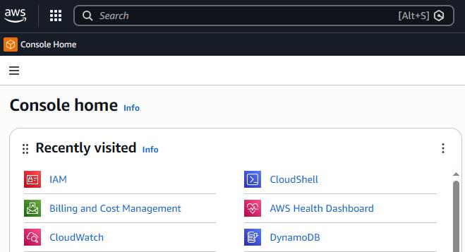
---

If you already have a policy that requires the use of MFA to login then you should use that policy. You will only need the name for the policy in a later step.

If you do not have such a policy then use the following procedure.

- Click '**Policies**'
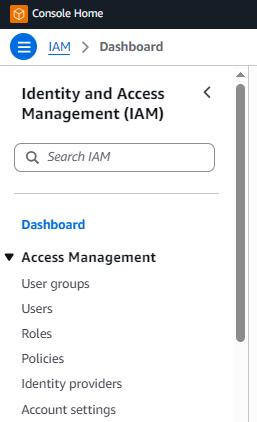
---

- click '**Create policy**'
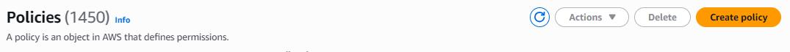
---

- click on the '**JSON**' tab

The screen should change to show the following:
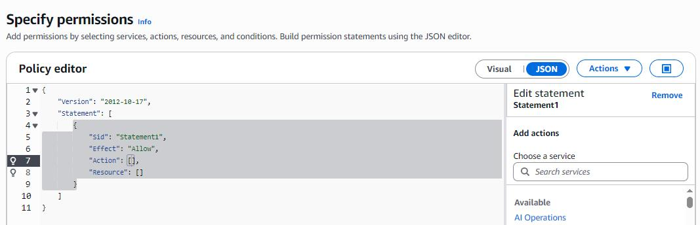

- delete all the text shown in the '**Policy editor**' window
- paste in the following policy:
```json
{
    "Version": "2012-10-17",
    "Statement": [
        {
            "Sid": "AllowViewAccountInfo",
            "Effect": "Allow",
            "Action": "iam:ListVirtualMFADevices",
            "Resource": "*"
        },
        {
            "Sid": "AllowManageOwnVirtualMFADevice",
            "Effect": "Allow",
            "Action": [
                "iam:CreateVirtualMFADevice",
                "iam:DeleteVirtualMFADevice"
            ],
            "Resource": "arn:aws:iam::*:mfa/*"
        },
        {
            "Sid": "AllowManageOwnUserMFA",
            "Effect": "Allow",
            "Action": [
                "iam:DeactivateMFADevice",
                "iam:EnableMFADevice",
                "iam:GetUser",
                "iam:ListMFADevices",
                "iam:ResyncMFADevice"
            ],
            "Resource": "arn:aws:iam::*:user/${aws:username}"
        },
        {
            "Sid": "DenyAllExceptListedIfNoMFA",
            "Effect": "Deny",
            "NotAction": [
                "iam:CreateVirtualMFADevice",
                "iam:EnableMFADevice",
                "iam:GetUser",
                "iam:ListMFADevices",
                "iam:ListVirtualMFADevices",
                "iam:ResyncMFADevice",
                "sts:GetSessionToken"
            ],
            "Resource": "*",
            "Condition": {
                "BoolIfExists": {
                    "aws:MultiFactorAuthPresent": "false"
                }
            }
        }
    ]
}
```
This policy makes it so that if the user does not use MFA to login then they have all permissions denied, except the permissions to view and set up their own MFA devices.

If the user has logged in successfully with MFA, then they will be granted all the permissions in their user profile.
- after you have entered the text, click '**next**'

---

- give this policy a name ('*AllowOnlyMFA*' is this example)
- (optional) enter a brief description of what this policy does
- click '**Create policy**'


---
# Step 2 - create the administrators group
You now need to create a group that will hold the identities of user accounts that should have administrator-level access.

- in the IAM sidebar on the left, click '**User groups**'
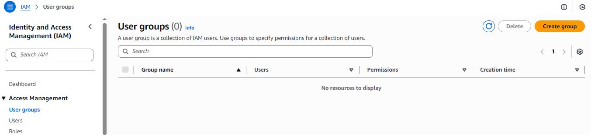

---
- in the 'Create user group' screen give a name for this group. In this example the name will be '*admins*'

- then click on the '**Create user group**' at the bottom of the page

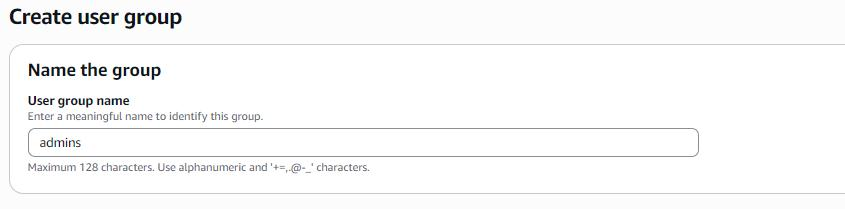

---
The page will refresh to show that the new group was successfully created. Now you need to attach several policies to this group, to ensure that all members of the group have logged in using MFA and also so that members of this group have administrator-level permissions.

. click on the name of your administrative group
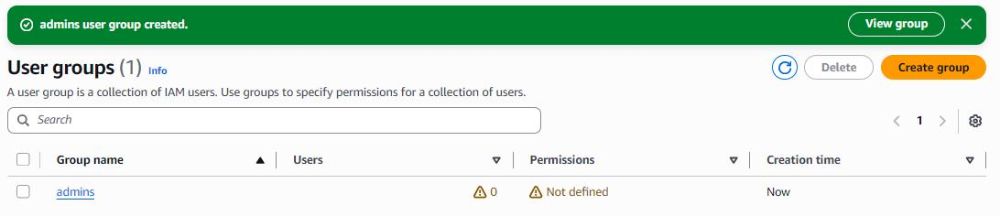

---
The page refreshes to show the group's details.
- click on the '**Permissions**' tab
This page will show which policies have been attached to this group. As it is a new group there should be none.
- click on '**Add permissions**', and then '**Attach policies**' from the dropdown list

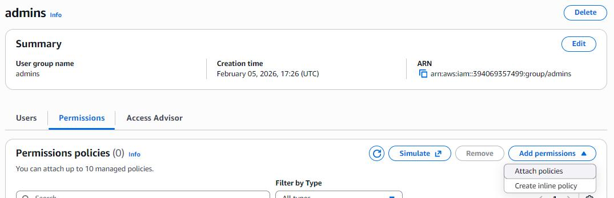
---

- in the search box, enter the name of the policy you created in step 1 (in this example, '*AllowOnlyMFA*')
- select the checkbox next to the policy name
- repeat this for the policy named '*AdministratorAccess*'
- do it again for the policy named  '*IAMUserChangePassword*'

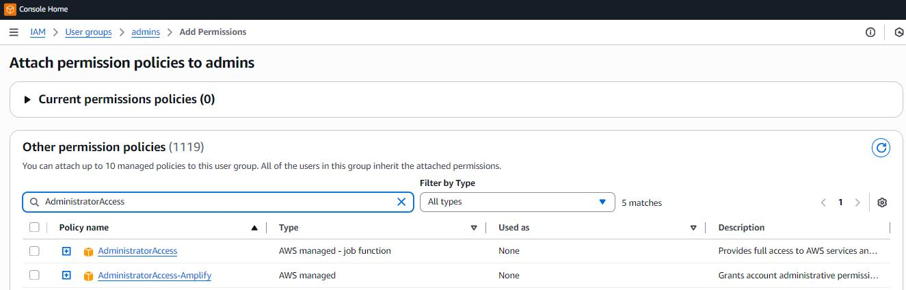
---

- click '**Next: Review**' at the bottom of the page
---
- review the policies you have selected to attach to this group, and then click '**Add permissions**' at the bottom of the page
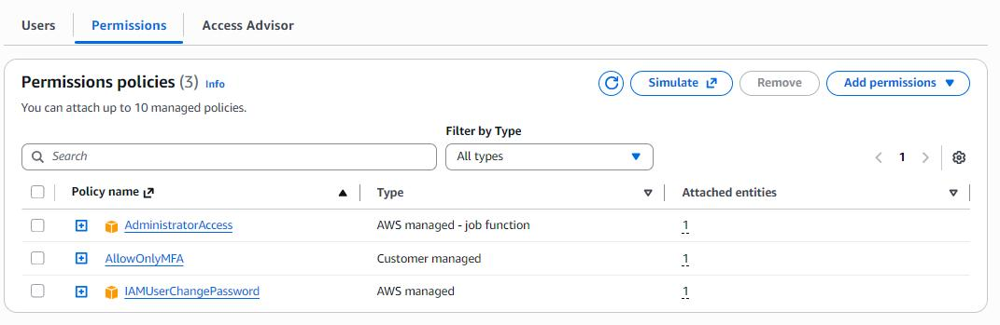

---
The page refreshes to show you the IAM group you have just created for administrative users. You will see that the number of users in this group is '0' (zero).
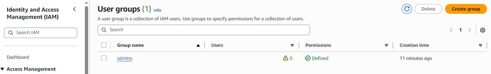

---
To add a user to your administrative group, first click on the group name. In the view that appears, click on the '**users**' tab. It will show a blank list, as the new group has no member accounts. Click on '**Addusers**' in the top right of the section.
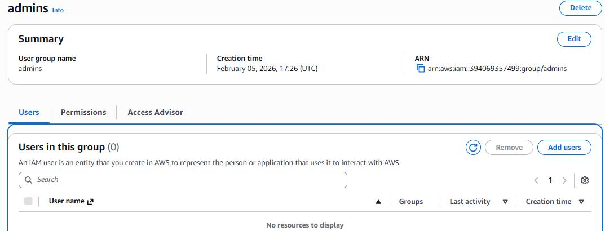

---
The next screen should show the 'Add users to..' heading, and show a list of IAM users in your VPC. You can use the '*Search*' box to help locate the username you want. When you have found the user account that you want to add to your administrative group, click to select that user account.

You can use this screen to add multiple users to the group, if you want. When you are ready click on the '**Add users**' button in the bottom right of the screen.
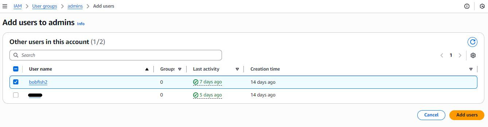

----
And that is that! You should now see that the user account (*bobfish2*) has been added to the administrative group (*admins*). Now when bobfish2 logs in to your AWS environment, their user account will inherit administrative permissions from the admin group, as their user accunt is part of that group.
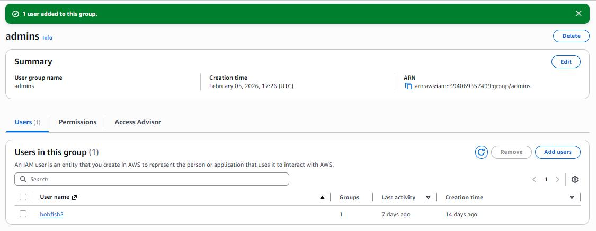
 
 ----
