# How to host a static website on AWS S3 - Step by step

## Step 1: Access and general setup
- login to your account at https://console.aws.amazon.com/

- select region that you want to host the bucket by clicking the region selector in the top righthand corner. Select the region to best fits your needs.  
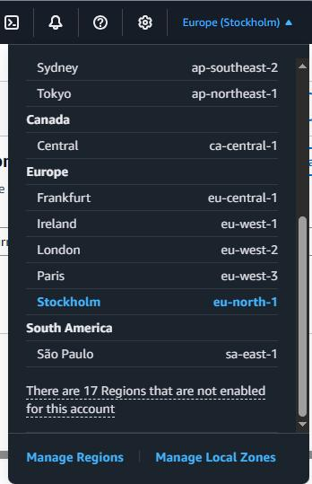

## Step 2: Create a bucket
- navivate to the S3 main page. A link to it may be in the 'Recently visited' list, or you can search for S3 in the search box at the top of page. Or, you can goto https://console.aws.amazon.com/s3/

- click on '**General purpose buckets**' in the top bar and then click the 'Create bucket' button
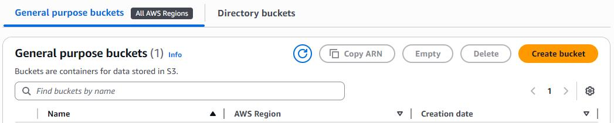

- in the Create Bucket menu that opens, make sure that the '**General purpose**' option is selected and then set the name of your bucket
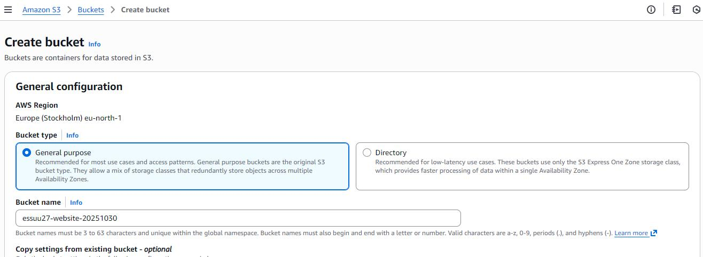

-- [**Note**] The name of a bucket must be valid according to AWS' [bucket naming rules](https://docs.aws.amazon.com/AmazonS3/latest/userguide/bucketnamingrules.html)  
If the name of your S3 bucket is **not** 'unique' in the current AWS partition it will be rejected and the bucket will not be created. If you have trouble making a unique name, one trick can be to use a format like **yourUsername-bucketLabel-date** . So the bucket shown in the graphic would be named **essuu27-website-20251030**.

- scroll down to the section titled '**Block Public Access settings for this bucket
**'

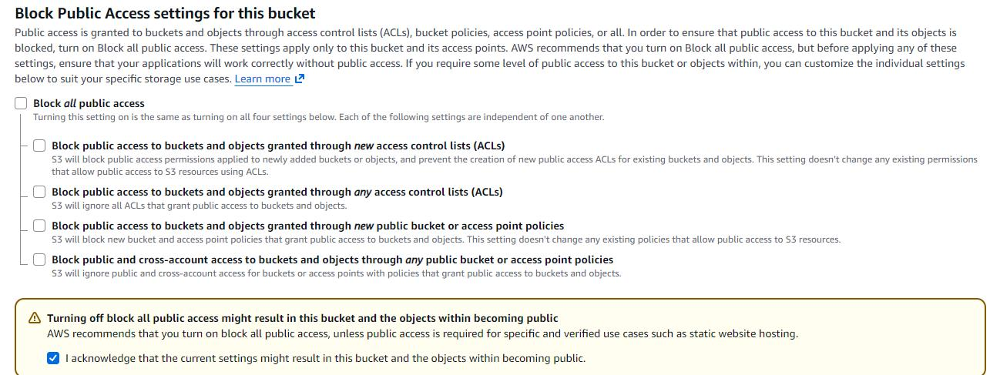

- deselect/clear the '**Block all public access**' option  
  -- a warning appears, '**Turning off block all public access might result in this bucket and the objects within becoming public**'. Select the acknowledgement option
- scroll to bottom of screen, click on 'Create bucket'

- the page will update, showing a success message and a list of your S3 storage buckets
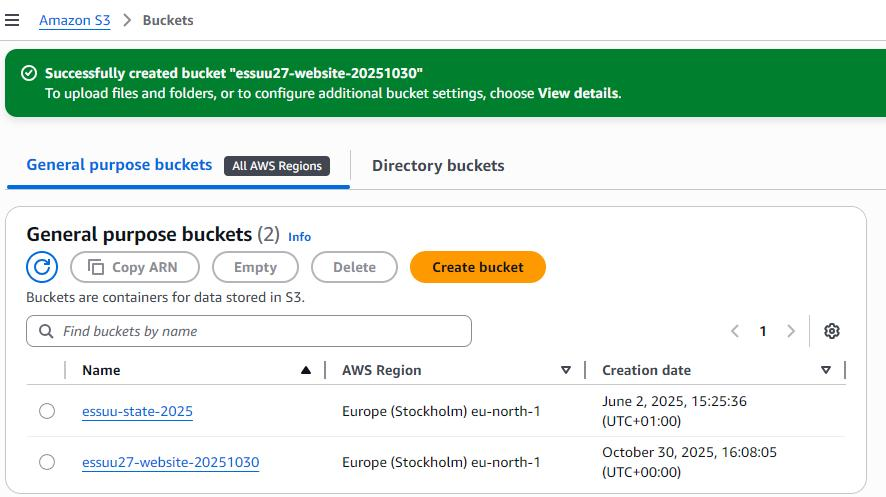

## Step 3: Enable static website hosting
- from that list, click on the name of the bucket that you just created
- on the next page, click on '**Properties**' in the toolbar near the top of the screen
- the page refreshes to show the region that stores the bucket, the bucket's ARN and creation date.
  -- Unless you planning to have more than one account update this website, you probably won't have to change the '**Bucket Versioning**' or '**Multi-factor authentication**' options.
- scroll to the bottom of tha page and the section titled '**Static website hosting**'. It should show that S3 static website hosting is disabled
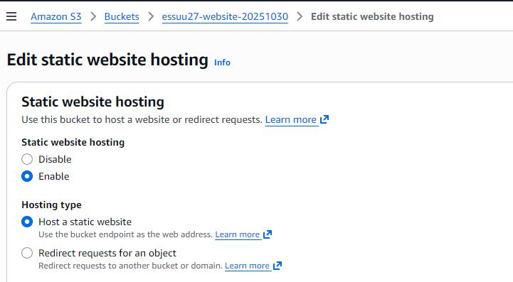

- click '**Edit**' on the right hand side of the page. The page updates to show the option to enable website hosting. Click '**enable**'.
- a new section opens below. Make sure that '**Host a static website**' is selected.
- set the name for the '**Index document**'. The '**Error document**' setting is optional, set it if you want to use your own error webpage.

- scroll to the bottom of the page and click on '**Save changes**' button
  
- the page refreshes. It should show '**Successfully edited static website hosting**'.
- the '**Bucket website endpoint**' is shown at the bottom of this page. This is the URL you need to access this website. Make a note of this URL.

- if you click on the link now the webserver will return a '**403 Forbidden**' webpage, as the policy of the bucket holding the website does not allow access to its contents.

## Step 4: Add a bucket policy that makes your bucket content publicly available
- scroll back to the top of this page and click on '**Permissions**' in the top toolbar
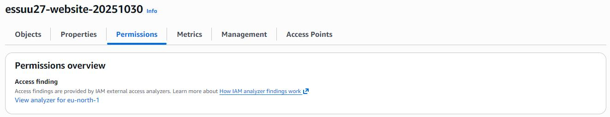

- in this view you should see that '**Block all public access**' is set to **Off**
- scroll down to the '**Bucket policy**' text area, click on the '**Edit**' button on the right. Then copy and paste the following policy into the text area:
```
{
    "Version": "2012-10-17",
    "Statement": [
        {
            "Sid": "PublicReadGetObject",
            "Effect": "Allow",
            "Principal": "*",
            "Action": [
                "s3:GetObject"
            ],
            "Resource": [
                "arn:aws:s3:::Bucket-Name/*"
            ]
        }
    ]
}
```
- in the ARN, replace '**Bucket-Name**' with the name of the bucket you are configuring  
 -- This policy allows anyone read-only access to the files and directories stored in this bucket. This is needed if you want to have a publicly accessible website.
**Warning** Be careful to only upload files that you want to be publicly available.

- scroll to the bottom of the page and click on '**Save changes**' button

- the page refreshes and shows '**Successfully edited bucket policy**'

- click on '**Objects**' near the toolbar at the top of the page. The page refreshes to show the contents of the storage bucket. As it is a new bucket there should be nothing there.
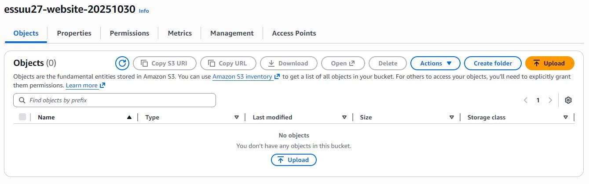

- click on the '**Upload**' button on the right hand side

- the 'upload' page opens.
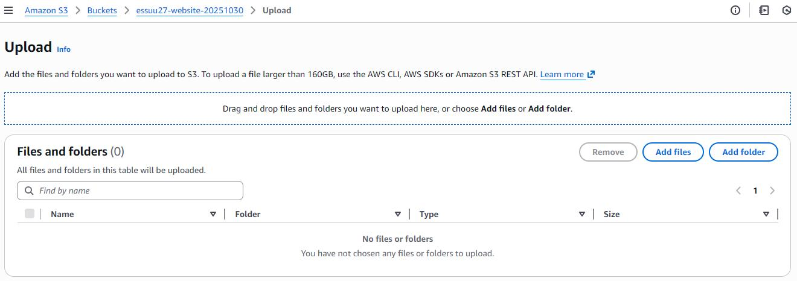

- You can add your website files here by either:
    - using drag and drop to pull your files into the entry box near the top of the screen,  
    - click on '**Add files**' to add individual files
    - or, click on '**Add folder**'to upload an entire folder

- the '**Files and folders**' section should show the files you have staged to upload.
- when you have all the files ready to upload, click on the '**Upload**' button in the bottom right of the screen

- the page will update to show '**Upload succeeded**' and, a list of files that have been uploaded to the storage bucket
- click the '**Close**' button at the top of the page, on the right hand side
- you should be back in the page showing the objects in your storage bucket. You can add more files if you want by clicking on the '**Upload**' button.

- in a seperate browser window, open the URL for your storage bucket. If you do not have a copy of the url, then click on '**Properties**' in the toolbar, and scroll to the bottom of the page. The storage bucket URL will be shown there.

- the webpage you just uploaded should appear, like this:
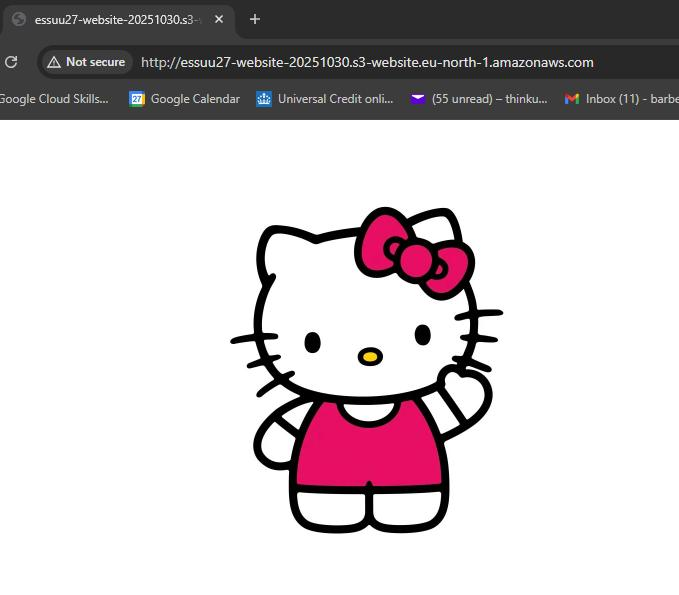

As you can see, a truly award winning webpage that will be celebrated for many years to come! :grin:

## Breaking down the website
If you have no further use of the website then you really should delete the resources that you have used. This removes the chances of you receiving any upexpected charges.

To delete the storage bucket, and its contents follow these steps:
- goto https://console.aws.amazon.com/s3/
- click on '**General purpose buckets**' in the left hand sidebar
- the page should now show all the general purpose storage buckets you have created.
- click the option next to the name of the storage bucket you want to delete
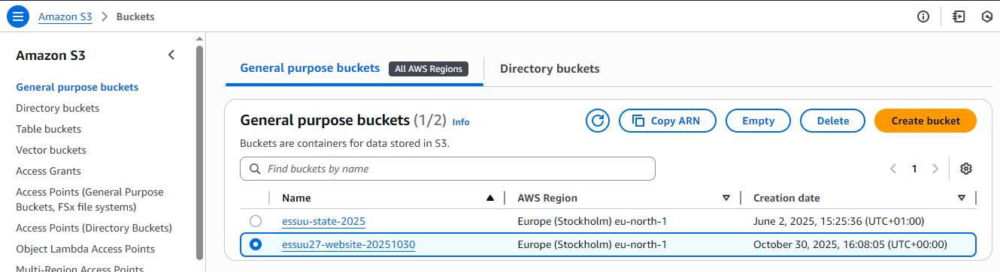

- then click on the '**Delete**' button near the top of the page

- the page refreshes. As the bucket you are trying to delete contains the files for the website you will receive a message saying that '**The bucket is not empty**'. Click on the '**Empty bucket**' button to clear the bucket's contents.
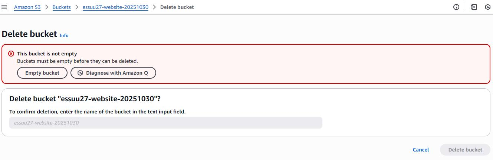

**Warning** If you empty the storage bucket then all files and folders will be deleted forever. There is no way to recover these items. Make sure you have copies of anything that you want to keep.

-- the 'Empty bucket' page opens. To confirm that you want to empty this storage bucket you need to type '**permanently delete**' into the text box at the bottom of the screen.
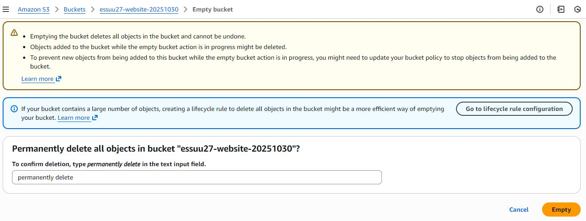

-- then, when you are ready, click on the '**Empty**' button in the bottom right hand corner

-- the page refreshes. It should show a 'Successfully emptied bucket <bucket-name>' message. It will show you how many objects were deleted.

-- it also shows whether it failed to delete any of the files. If you do see any deletion failures make sure you do not have any files from your website open in any browser windows. Then try again.

-- after you've finished emptying the storage bucket, click on the '**Exit**' button in the top right corner.

- back on the '**General purpose buckets**' page, select the storage bucket you want to delete
- click the '**Delete**' button in the top toolbar
- the '**Delete bucket**' page opens. You need to type the name of the storage bucket you want to delete into the text box at the bottom of the page.
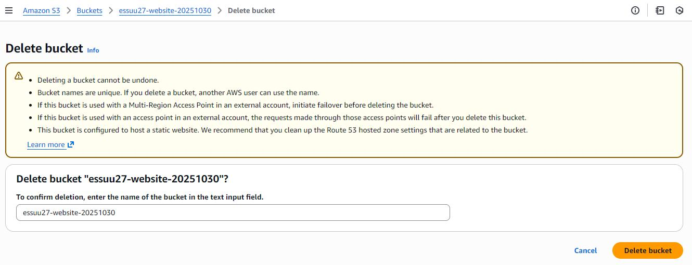

- when you're ready, click the '**Delete bucket**' button in the bottom right corner

- after a few seconds the page should update to show a current list of your storage buckets. It should have a message saying '**Successfully deleted bucket _<bucket-name>_**', as shown:
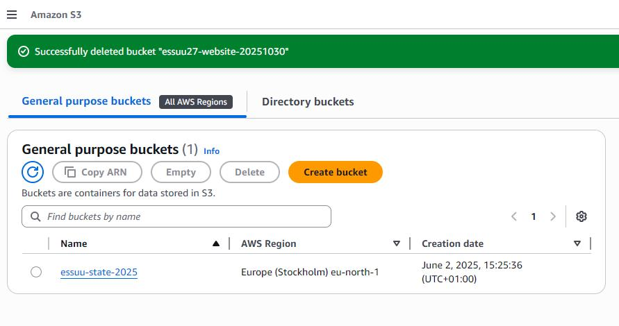

That's it, done!
