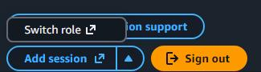

# Preparation
Before you start make sure you have the following details.

- the twelve digit ID for the VPC account. Substitute this for <VPCID> when shown in the instructions
- the name of the group you are setting up. Substitute this for <GRPNAME> when shown in the instructions

**Note:** in the notes the <TOP> 'location' is the 'root' of the web interface. For example, '<TOP>/IAM' refers to the IAM folder as seen in the sidebar.

# Procedure
## Step 1 - Create a role
- login to the VPC as a user with privileges to add/edit/delete IAM objects
- navigate to <TOP>/IAM/Roles
- click on '**Create role**'
- select '**Custom trust policy**' in '**Trusted entity type**'
- in the '**Custom trust policy**' area, paste following text, substituting the account ID for <VPCID>

```
{
   "Version": "2012-10-17",
    "Statement": [
        {
            "Sid": "Statement1",
            "Effect": "Allow",
            "Principal": {
                "AWS": "arn:aws:iam::<VPCID>:root"
            },
            "Action": "sts:AssumeRole"
        }
    ]
}
```

You can download a plaintext version of this role from [here] ( https://github.com/essuu27/AWS_stuff/blob/main/role-AssumeRoot.txt )

- click '**Next**'
- in '**Add permissions**', select '**Use existing policy**'
- select 'AdministratorAccess' from policy list
- click '**Next**'
- in '**Name, review, and create**' set the Role name.
- (optional) in '**Description**' box, give information about the role
check the entries shown are what you are expecting
- click '**Create role**'

After the screen loads, locate the ARN and take a copy of it. It will be used in the next step, marked as <ROLEARN>

## Step 2 - (optional) Create a policy to provide MFA for login
This step is only needed if you do not already have a policy that handles MFA for logins.

- navigate to <TOP>/IAM/Policies
- click '**Create policy**'
- In '**Policy Editor**', click on '**JSON**'
- delete all the text in the editor window
- paste the following into the editor window
```
{
    "Version": "2012-10-17",
    "Statement": [
        {
            "Sid": "AllowViewAccountInfo",
            "Effect": "Allow",
            "Action": "iam:ListVirtualMFADevices",
            "Resource": "*"
        },
        {
            "Sid": "AllowManageOwnVirtualMFADevice",
            "Effect": "Allow",
            "Action": [
                "iam:CreateVirtualMFADevice",
                "iam:DeleteVirtualMFADevice"
            ],
            "Resource": "arn:aws:iam::*:mfa/*"
        },
        {
            "Sid": "AllowManageOwnUserMFA",
            "Effect": "Allow",
            "Action": [
                "iam:DeactivateMFADevice",
                "iam:EnableMFADevice",
                "iam:GetUser",
                "iam:ListMFADevices",
                "iam:ResyncMFADevice"
            ],
            "Resource": "arn:aws:iam::*:user/${aws:username}"
        },
        {
            "Sid": "DenyAllExceptListedIfNoMFA",
            "Effect": "Deny",
            "NotAction": [
                "iam:CreateVirtualMFADevice",
                "iam:EnableMFADevice",
                "iam:GetUser",
                "iam:ListMFADevices",
                "iam:ListVirtualMFADevices",
                "iam:ResyncMFADevice",
                "sts:GetSessionToken"
            ],
            "Resource": "*",
            "Condition": {
                "BoolIfExists": {
                    "aws:MultiFactorAuthPresent": "false"
                }
            }
        }
    ]
}
```

You can download a plaintext version of this policy from ( here ) [https://github.com/essuu27/AWS_stuff/blob/main/policy-EnableMFA.txt ]

click '**Next**'

The next screen is titled '**Review and create**'
- enter the policy name (**login_mfa**, in this example)
- (optional) enter a description of the policy's function in the '**Description**' box
- scroll down and click on '**Create policy**'

## Step 3 - create user group
- navigate to <TOP>/IAM/Iam user groups
- set the group name in the '**User group name**' text box
- (optional) you can add users to the group now, if you want.
- for AdministratorAccess users, add the following list of permissions to the group:
```
AWSManagementConsoleBasicUserAccess
AWSSecurityHubReadOnlyAccess
AWSServiceCatalogAdminReadOnlyAccess
ReadOnlyAccess
```
- also, add the MFA policy that you created earlier:
- click '**Add permissions**' button on the right hand side from dropdown
- select '**Create inline policy**'
- on the next screen, in '**Policy editor**' heading, click on '**JSON**'
- delete all text in '**Policy editor**' text box then paste in the following policy:
```
{
    "Version": "2012-10-17",
    "Statement": {
        "Effect": "Allow",
        "Action": [ "sts:AssumeRole" ],
        "Resource": [
            "arn:aws:iam:::role/"
        ]
    }
}
```
You can download a plaintext version of this policy from (here) [ https://github.com/essuu27/AWS_stuff/blob/main/policy-AssumeRole.txt ]

- click '**Next**' at the bottom of the screen

- in the '**Policy details**' section, give a name for this policy
- check that '**STS**' is shown in the 'Allow (1 of 475 services)' section of next page
- click on '**Create policy**'

## Step 5 - Add users to the group
Either:

- navigate to <TOP>/IAM/Iam user groups
- select the box next to the admin users group name
- click on '**Add users**'
- select the users you want to add to the group
- click on '**Add users**'

Or:

- navigate to <TOP>/IAM/Iam users
- click on the username you want to add to the group
- select the '**Groups**' tab
- click the box next to the admin users group name
- click on '**Add user to group(s)**'

[ **Note** ] You will need to send the user the VPC ID and role name as they need to use these the first time that they connect to the administrator role.

## User assuming the role
- the user logs in to the VPC
- they click on their own username in the top right hand corner of the page
- scroll down to the bottom of the drop down menu that appears
- click on the triangle icon to the right of '**Add session**'
- click on '**Switch role**', as shown:


- on the next page, the user will have to fill in the '**Account ID**'. This is the <VPCID> that you sent to them.
- in '**IAM role name**', give name of the admin role
- (optional) in '**Display name**', the user can set the label they want to see presented for this role
- finally, the user should click on '**Switch role**'

A new window will open showing the role name in the top right hand corner. This is their ‘administrator’ window. On subsequent uses, the user will not have to give the <VPCID> as they should see the role name in their list and they can then click on that link

## Managing the administrator group
Managing which users have access to the administrator role is easy. You just need to add the username to the administrator group.

Similarly, removing the username from the group removes access to the administrator role.

Do the following to add users to the administrator group:

- navigate to <TOP>/IAM/Iam user groups
- select the box next to the admin users group name
- click on '**Add users**'
- select the users you want to add to the group
- click on '**Add users**'

The procedure to remove users is:

- navigate to <TOP>/IAM/Iam user groups
- select the box next to the admin users group name
- select the users you want to remove from the group
- click on 'Remove'
- a panel will open asking you to confirm that the users are to be removed from the group. Click ‘**Remove**’

## Monitoring user access and administrator role usage
- navigate to <TOP>/CloudTrail/Event History
**ConsoleLogin** events will show the time and username of the user logging in to the VPC
**SwitchRole** events show which user has assumed a role in the VPC

Looking at these two sets of entries should make it easier to track who has logged in to the VPC and assumed the administrator role.
